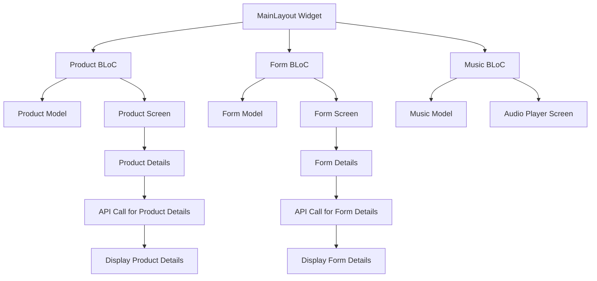

# Flutter App Architecture & Workflow

## **Overview**
This Flutter app is designed using the **BLoC** (Business Logic Component) pattern to manage state and business logic in a clean, scalable way. The app consists of three main components:

- **Product Management**: Handles product data and display.
- **Form Management**: Handles user input and form data.
- **Music Control**: Manages music playback functionality.

## **Key Features**
- **BLoC for State Management**: BLoC is used to manage the state for products, forms, and music independently.
- **API Integration**: API calls are made to fetch product details and form data.
- **Modular Architecture**: Each feature (product, form, music) is decoupled, making the app scalable and maintainable.

## **Workflow Diagram**

Here’s the **Mermaid** flowchart illustrating the app's workflow:

## **App Workflow**
The app's workflow consists of three main BLoCs managing their respective functionalities:

### 1. **Main Layout Widget**
- The entry point for the app. It contains the navigation and controls the app's primary structure.
- It interacts with three BLoCs: **Product BLoC**, **Form BLoC**, and **Music BLoC**.

### 2. **Product BLoC**
- Manages product-related logic such as fetching product details and displaying them in the app.
- Interacts with the **Product Model** to store and fetch product data.
- Fetches data from an API and populates the **Product Screen** with the fetched product details.

### 3. **Form BLoC**
- Handles form input validation and submission.
- Manages the **Form Model** to store and validate form details.
- Displays the **Form Screen** where users can input their details.

### 4. **Music BLoC**
- Controls the playback of music.
- Manages the **Music Model** to handle play/pause, volume, and track information.
- Displays the **Audio Player Screen** for the user to control the music.

## **How the BLoC Pattern Works**

### **Product BLoC**

- The **Product BLoC** fetches data when the user navigates to the **Product Screen**.
- It triggers an API call to get the product details and displays them.
- The **Product Model** holds the product data and is used by the BLoC to manage the state.

### **Form BLoC**
- The **Form BLoC** validates the form input, ensuring that the user enters valid information.
- Upon submission, it stores the form data in the **Form Model** and displays the details on the next screen.

### **Music BLoC**
- The **Music BLoC** handles the playback functionality, including play/pause and volume control.
- The user interacts with the **Audio Player Screen**, which communicates with the **Music Model** to update the playback state.

## How to Run the App

### 1. Clone the Repository

Clone the repository with:

```bash
cd blocbase
git clone https://github.com/ShashwatXD/bloccin

```
###2. Install Dependencies
```bash
 flutter pub get
```
### 3.Run the App
```bash
flutter run
```
### **Conclusion-**
This app demonstrates the use of the BLoC pattern for managing state in Flutter. By separating UI and business logic, the app remains scalable, maintainable, and easy to expand.

